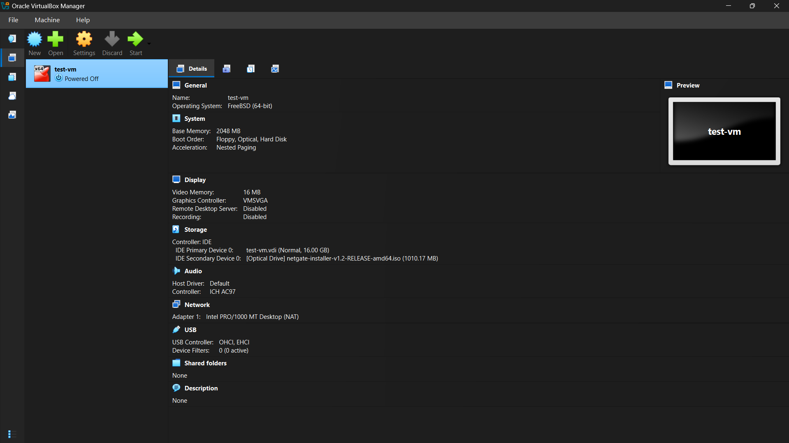

# home-lab-vlan-security

## Step 1 Log — [19-june-2026]

**What I installed:** Oracle VirtualBox 

**My machine specs:**
- Base Memory: [2048 Mb]
- RAM: [ 16GB]
- OS: [FreeBSD (64bit)]

- Confirmed virtualization (VT-x) enabled in BIOS
- Installed VirtualBox, opened Manager successfully
- Downloaded Ubuntu Server 24.04 LTS ISO for future test VMs
- Created a test VM shell to get familiar with the VM creation wizard

**Screenshot:** 

**Next:** Step 2 — plan VLAN/IP scheme
**Next:** Step 2 — plan VLAN/IP scheme

---

## Step 2 Log — [21-june-2026]
**Goal:** Plan VLANs and IP addressing scheme on paper before touching pfSense.

### IP Addressing Table

| VLAN  | VLAN ID | Network (CIDR) | Subnet Mask     | Gateway     | Static/Reserved Range        | DHCP Scope                   |
|-------|---------|-----------------|------------------|-------------|-------------------------------|-------------------------------|
| Admin | 10      | 10.0.10.0/24     | 255.255.255.0    | 10.0.10.1   | 10.0.10.2 – 10.0.10.20        | 10.0.10.21 – 10.0.10.254      |
| Guest | 20      | 10.0.20.0/24     | 255.255.255.0    | 10.0.20.1   | 10.0.20.2 – 10.0.20.20        | 10.0.20.21 – 10.0.20.254      |
| IoT   | 30      | 10.0.30.0/24     | 255.255.255.0    | 10.0.30.1   | 10.0.30.2 – 10.0.30.20        | 10.0.30.21 – 10.0.30.254      |

**Next:** Step 3 — deploy pfSense as a VM
